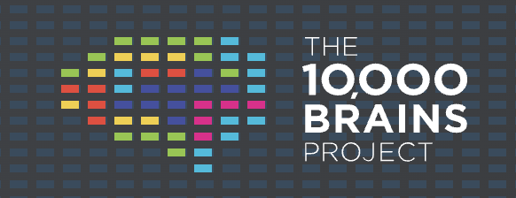

# path-nd-uploader

A command-line tool for sending pathology whole-slide images (`.svs` and
similar formats) to Google Cloud Storage. Before anything is uploaded, it
checks two things:

1. **The slide file itself isn't corrupted** — most importantly, that it
   wasn't cut off partway through an upload (a real failure mode this tool
   was built to catch: an interrupted upload left a slide with its last
   10-20% zero-filled and unreadable, sitting undetected in a bucket).
2. **The metadata describing the slide is complete and correctly formatted**,
   checked against the standardized
   [Path-ND CDE schema](https://github.com/The-10-000-Brains-Project/pathnd-cdes).

Anything that fails either check is not uploaded — you'll see exactly why,
so you can fix it and try again.

## Before you start

You'll need:

- **Python 3.10 or newer.** Check with `python3 --version` in a terminal;
  if that fails, install it from [python.org](https://www.python.org/downloads/).
- **Access to the destination Google Cloud Storage bucket**, and the
  `gcloud` command-line tool installed ([instructions](https://cloud.google.com/sdk/docs/install)) —
  needed once, for the sign-in step below.
- This project's folder, on your computer, and a terminal open **inside it**
  (e.g. `cd path/to/uploader`).

## One-time setup

Run these once, in a terminal, from inside the project folder:

```bash
python3 -m venv .venv
source .venv/bin/activate      # Windows: .venv\Scripts\activate
pip install .
```

`source .venv/bin/activate` needs to be run again each time you open a new
terminal window — you'll know it worked because your prompt starts with
`(.venv)`.

Then sign in to Google Cloud, so the tool is allowed to read/write the bucket:

```bash
gcloud auth application-default login
```

This opens a browser window to log in. You only need to do this once per
computer (it may expire after a while — if commands below start failing
with an authentication error, just run this again).

That's it — test it worked with:

```bash
path-nd-uploader schema show
```

You should see a field count and a version number. If you see
`command not found` instead, the venv likely isn't activated — re-run the
`source .venv/bin/activate` line above.

## Preparing your metadata

Each slide needs a small JSON file describing it, with the same name as the
slide but ending in `.json`. For a slide at `45122.svs`, create `45122.json`
next to it:

```json
{
  "participant_id": "P-00231",
  "brain_bank_id": "BB-4471",
  "study": "Path-ND",
  "slide_paths": "45122.svs",
  "stain_type": "HE",
  "scanner_manufacturer": "Leica",
  "scanner_objective_magnification": "40"
}
```

`participant_id`, `brain_bank_id`, `study`, `slide_paths`, and `stain_type`
are required on every slide. To see the full, current list of fields (this
can change over time), run:

```bash
path-nd-uploader schema show
```

**Already have a spreadsheet of slide metadata instead** (one row per
slide, covering many slides at once)? You don't need to create individual
JSON files — see [Uploading many slides at once](#uploading-many-slides-at-once)
below, which reads a CSV directly.

**Coming from a brain bank whose export doesn't already match the field
names above** (e.g. BDR's raw export uses `donor_id`, `GENDER`, `slide_name`,
etc. instead)? See [Raw institutional exports](#raw-institutional-exports)
below.

## Everyday commands

**Check a slide before uploading anything** (safe to run as many times as
you like — it never touches the cloud):

```bash
path-nd-uploader validate 45122.svs --metadata 45122.json
```

```
[PASS] 45122.svs
```

If something's wrong, you'll see exactly what and where, for example a
slide that was cut off mid-upload:

```
[FAIL] 45122.svs
    [error] zero_tail: last 1,253,880 bytes (30.0% of the file) are zero-filled — likely a truncated/interrupted upload; the pyramid directory is probably unreachable
```

**Upload one slide** (only actually uploads if validation passes):

```bash
path-nd-uploader upload 45122.svs --metadata 45122.json --bucket my-bucket-name
```

### Uploading many slides at once

Point it at a folder containing your slide + `.json` pairs, or at a CSV/JSON
manifest with one row per slide:

```bash
path-nd-uploader batch ./incoming --bucket my-bucket-name --report run_report.json
```

`--report run_report.json` saves a detailed record of what passed, what
failed, and why — worth keeping for your own records. Omit `--bucket` to
only validate the whole batch without uploading anything yet.

### Checking a bucket that's already been uploaded to

To scan slides already sitting in a bucket for the same kind of corruption
(without re-downloading everything):

```bash
path-nd-uploader audit my-bucket-name --prefix Collection_PART/ --report audit_report.json
```

### Raw institutional exports

If your metadata comes from a system that doesn't already use this
project's field names (for example, BDR's raw CSV export), pass
`--profile <name>` and the tool will translate it automatically:

```bash
path-nd-uploader batch BDR_Slides_metadata.csv --bucket my-bucket-name --profile bdr
```

Run `path-nd-uploader batch --help` to see which profiles are available.

## If you see `[NEEDS REVIEW]`

This means something couldn't be automatically resolved and needs a human
to look at it — but it does **not** block the upload. Common examples:
a value that could plausibly mean two different things (so the tool refuses
to guess), or a field the source system simply doesn't provide. Search for
`needs_review` in your `--report` output to find every instance across a
batch.

## Troubleshooting

| You see | What it means |
|---|---|
| `command not found: path-nd-uploader` | The virtual environment isn't activated — run `source .venv/bin/activate` (from inside the project folder) again. |
| An authentication / permission error mentioning Google Cloud | Run `gcloud auth application-default login` again, and confirm you actually have access to the bucket you're targeting. |
| `[error] zero_tail: ...` | The slide file itself is corrupted/truncated — usually from an interrupted upload or copy. Re-copy or re-scan the original slide; don't retry the same file. |
| `[error] reconcile.slide_paths: ...` | The metadata's `slide_paths` doesn't match the file you're actually uploading, or points at a file that doesn't exist. |
| `[NEEDS REVIEW] ...` | See [above](#if-you-see-needs-review) — doesn't block upload, but needs a human decision. |

## For developers

Update the pinned CDE schema (it's vendored, not fetched live, so
validation results stay reproducible):

```bash
scripts/update_schema.sh v1.1.0   # or a commit SHA
```

Install with test dependencies and run the test suite:

```bash
pip install -e ".[dev]"
pytest
```

Project layout, the mapping-profile framework, and the integrity-check
internals are documented in module docstrings under `src/pathnd_uploader/`.
